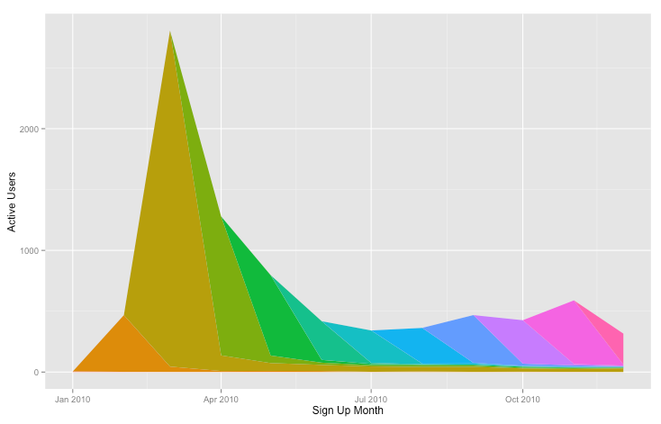

# Active User Cohort Analysis in R

This is an R script that allows you to analyze active users by sign up cohort.

If you've never used R before, you'll need to [install R](https://cran.r-project.org/mirrors.html) and optionally download a tool like [RStudio](https://www.rstudio.com/products/rstudio/download/) to run this script. You'll also need to install the `ggplot2` package with `install.packages("ggplot2")` and use `setwd()` to change the working directory to match the location of this script.

## How it works

If you run a web or mobile app, you might be interested to know how many active users your app has each month. This R script will not only help you figure that out, but it will break down the active users each month into cohorts based on when the user was first seen.

In order for it to work, all you need to do is to generate a CSV file containing a list of user ids and dates when the users performed actions in your app. See `data/test-data.csv` for the format.

You'll need to edit the `CSV_PATH` and `CSV_SEPARATOR` at the top of `active-users.r` depending on where you place the data file and whether the file comma-separated or tab-separated.

## Testing the script

Within RStudio, simply load the script using `source("active-users.r")`. If all went well, it should generate the following chart:

## Contact

If you have any suggestions, find a bug, or just want to say hey drop me a note at [@mhmazur](https://twitter.com/mhmazur) on Twitter or by email at matthew.h.mazur@gmail.com.

## License

MIT © [Matt Mazur](http://mattmazur.com)
